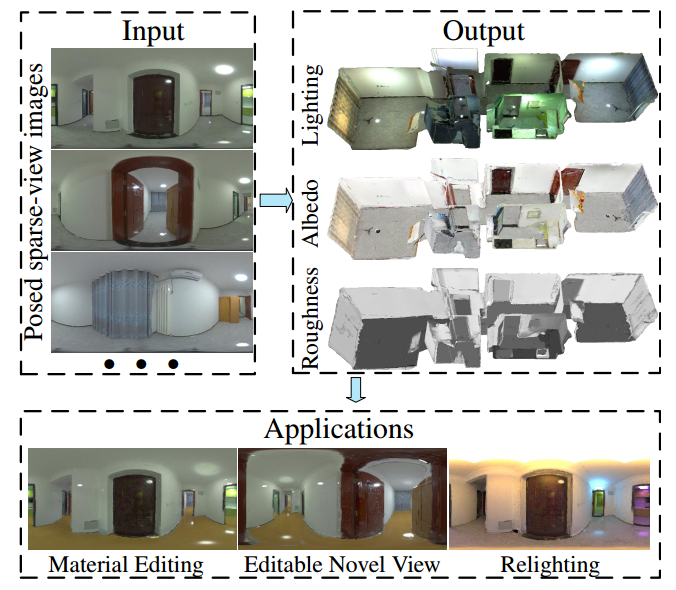

## TexIR

This is official code for the paper accepted to CVPR 2023, "Multi-view Inverse Rendering for Large-scale Real-world Indoor Scenes".

[Project Page](http://yodlee.top/TexIR/) | [Paper](https://arxiv.org/abs/2211.10206)



----

#### 1. Installation

We encourage users to run our code in the Docker, which ensures the reproducibility of our implementation.

First, please follow [nvdiffrec](https://github.com/NVlabs/nvdiffrec#server-usage-through-docker) to build a basic docker image.

Second, start an interactive docker container: `docker run --runtime nvidia -it --rm --user root --gpus device=0 -v /your_data_folder:/data -v /code_folder:/code nvdiffrec:v1 /bin/bash `

Finally, install python packages in the container. `pip install -r requirements.txt`

#### 2. Data

We release the [real dataset]() and [synthetic dataset]() proposed in the paper. (Updating links, TODO)

#### 3. Running in our data

We also release our precomputed irradiance, both NIrF and IrT.  Therefore, users could directly run the **Material estimation** with IrT. Users also could reproduce the NIrF and IrT via **PIR**.

##### 3.1 Material estimation

For the synthetic dataset, please change the value of 'path_mesh_open3d' into the actual path in the container and run:

```
python3 trainer/exp_runner.py --conf configs/syn.conf --expname syn1 --trainstage MatSyn --gpu auto
```

For the real dataset, please change the value of 'path_mesh_open3d' into the actual path in the container and change the value of 'hdr_exposure'.  Scene 1 and Scene 7 use exposure 3 and others use exposure 5. By the way, please change the threshold in the [loss.py]() according to comments.

Finally, please run:

```
python3 trainer/exp_runner.py --conf configs/mat_hdrhouse.conf --expname scene1 --trainstage Mat --gpu auto
```

##### 3.2 PIR (precomputed irradiance)

###### NIrF

For the real dataset, please change the value of 'path_mesh_open3d', similar to material estimation. Please run:

```
# NIrF
python3 trainer/exp_runner.py --conf configs/irrf_hdrhouse.conf --expname scene1 --trainstage IRRF --gpu auto
```

###### IrT

First, generating the IrT via ray tracing with 2048 samples.

There are some black regions in the IrT due to the error of UV mapping. Therefore, we do a simple padding to fill these regions in the texture space. 

Finally, we denoise the IrT to reduce noise produced by monte carlo sampling.

Please run:

```
# 1. generate noised IrT, change hdr_exposure in hdrhouse_ir_texture.conf
python3 trainer/exp_runner.py --conf configs/hdrhouse_ir_texture.conf --expname scene1 --trainstage IrrT --gpu auto
# 2. padding IrT. change the path of tools/padding_texture.py and denoise the IrT via a denoiser, e.g. oidn, optix.
python3 tools/padding_texture.py
```

##### 3.3 Evaluating previous methods

The sota multi-view object-centric neural rendering methods are [InvRender](https://github.com/zju3dv/invrender), [nvdiffrec](https://github.com/NVlabs/nvdiffrec) and [NeILF](https://github.com/apple/ml-neilf).

As described in the paper, we integrate their material optimization strategies with our lighting representation to handle large-scale indoor scenes.

Please run:

```
# note change exposure in .conf
# # real data
# invrender
python3 trainer/exp_runner.py --conf configs/mat_hdrhouse_invrender.conf --expname scene1 --trainstage Inv --gpu auto
# nvdiffrec
python3 trainer/exp_runner.py --conf configs/mat_hdrhouse_rec.conf --expname scene1 --trainstage RecMLP --gpu auto
# neilf
python3 trainer/exp_runner.py --conf configs/mat_hdrhouse_neilf.conf --expname scene1 --trainstage Neilf --gpu auto

# # synthetic data
# invrender
python3 trainer/exp_runner.py --conf configs/syn_invrender.conf --expname scene1 --trainstage InvSyn --gpu auto
# nvdiffrec
python3 trainer/exp_runner.py --conf configs/syn_rec.conf --expname scene1 --trainstage RecMLPSyn --gpu auto
# neilf
python3 trainer/exp_runner.py --conf configs/syn_neilf.conf --expname scene1 --trainstage NeilfSyn --gpu auto
```

#### 4. Running in custom data

Our code is not support to run in other custom datasets, e.g. Replica. If you want run our method with your data, please re-implement the interface or convert your data into our supported format, which consists of meshs, HDR images, UV-mapping, poses and segmentations.

#### Citation

We use the basic docker provided in [nvdiffrec](https://github.com/NVlabs/nvdiffrec), please cite both our paper and their paper if you use our code.

```
@inproceedings{li2022texir,
    title={Multi-view Inverse Rendering for Large-scale Real-world Indoor Scenes},
    author={Li, Zhen and Wang, Lingli and Cheng, Mofang and Pan, Cihui and Yang, Jiaqi.},
    booktitle = {Proceedings of the IEEE/CVF Conference on Computer Vision and Pattern Recognition.}, 
    year={2023}
}

@inproceedings{munkberg2021nvdiffrec,
    author = {Munkberg, Jacob and Hasselgren, Jon and Shen, Tianchang and Gao, Jun and Chen, Wenzheng and Evans, Alex and Mueller, Thomas and Fidler, Sanja},
    title = {Extracting Triangular 3D Models, Materials, and Lighting From Images},
    booktitle = {Proceedings of the IEEE/CVF Conference on Computer Vision and Pattern Recognition.},
    year = {2022}
}
```


